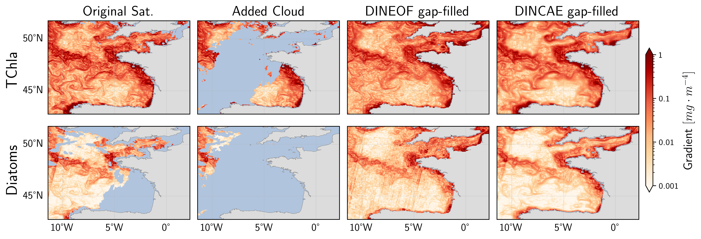
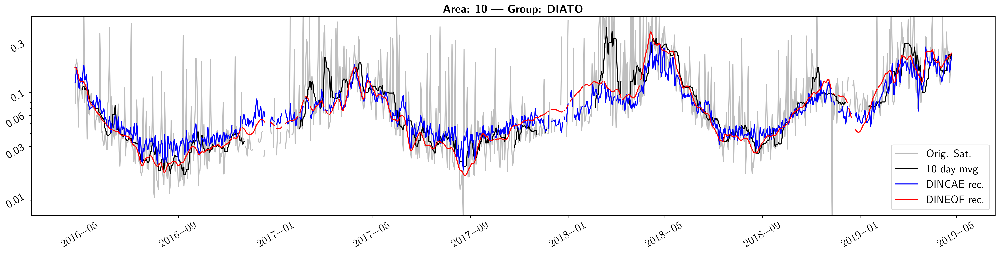

# Gapfilling of phytoplankton functional types (PFT)
**Objective:** This repository provides the necessary scripts for conducting and analysing two well-established satellite gap-filling methods, DINEOF and DINCAE, for gap-filling of total chlorophyll-a (TChla) and chlorophyll-a concentrations of five major PFT datasets provided by Copernicus Marine Service.

**Project:** Assessment of gap-filling techniques applied to satellite phytoplankton composition products for the Atlantic Ocean





## Requirements
### Models:
[**DINEOF**](https://github.com/aida-alvera/DINEOF)

[**DINCAE**](https://github.com/gher-uliege/DINCAE.jl)
### Datasets:
[**PFT**](https://doi.org/10.48670/moi-00280) Dataset ID: cmems_obs-oc_glo_bgc-plankton_my_l3-multi-4km_P1D

[**SST**](https://doi.org/10.48670/moi-00165) Dataset ID: METOFFICE-GLO-SST-L4-NRT-OBS-SST-V2

## Installation
Use Mamba or Conda for installation of necessary packages
```
mamba create --name PFT_gapfilling -c conda-forge --file requirements.txt
```
or
```
conda create --name PFT_gapfilling -c conda-forge --file requirements.txt
```
**Type II regression:** For type II regression in matchup analysis use [pylr2](https://github.com/OceanOptics/pylr2). The installation is explained in the package or directly use pip and git:
```
pip install git+https://github.com/OceanOptics/pylr2.git
```
### Interactive Environment
You can connect the environment to JupyterLab using:
```
python -m ipykernel install --user --name=PFT_gapfilling --display-name "PFT_gapfilling"
```
## Execute
All the necessary parameters for running all the scripts are stored in the [**params.py**](params.py) file. You can define the regions of interest (ROI) by changing the [**data/regions.csv**](data/regions.csv) file for defining different regions. The data pipeline is described in the corresponding publication.
A brief introduction to all the scripts:

- **params.py:** Dictionary containing all necessary directories and parameters.
- **function.py:** Extra functions used in several scripts.
- **1_1_preprocessing (input_analysis).ipynb:** Analysis the PFT satellite dataset for missing rate and uncertainty.
- **1_2_preprocessing (data_partitioning).ipynb:** Partitioning the data into training, validation and test datasets.
- **2_1_processing (DINCAE_random_search).jl:** Setting in Julia for random hyperparameters search for DINCAE gap-filling method.
- **2_2_processing (DINCAE_random_search).sh:** SLURM parallelization of DINCAE random hyperparameter search to several HPC nodes.
- **2_3_processing (DINEOF_random_search).py:** Setting in Python for random hyperparameters search for DINEOF gap-filling method.
- **2_4_processing (DINEOF_random_search).sh:** SLURM parallelization of DINEOF hyperparameter random search to several HPC nodes.
- **2_5_processing (DINCAE_loss_function).ipynb:** Visualisation of the DINCAE loss function progress.
- **3_1_processing (DINCAE_final).jl:** Optimal reconstruction run setting in Julia for DINCAE gap-filling method.
- **3_2_processing (DINCAE_final).sh:** SLURM parallelization of DINCAE optimal reconstruction of different areas to several HPC nodes.
- **3_3_processing (DINEOF_final).py:** Optimal reconstruction run setting in Python for DINEOF gap-filling method.
- **3_4_processing (DINEOF_final).sh:** SLURM parallelization of DINEOF optimal reconstruction of different areas to several HPC nodes.
- **4_1_postprocessing (cross_validation_DINCAE).ipynb:** Cross-validation between validation and test dataset with DINCAE gap-filled product.
- **4_1_postprocessing (cross_validation_DINEOF).ipynb:** Cross-validation between validation and test dataset with DINEOF gap-filled product.
- **4_2_postprocessing (cross_validation_error_distribution).ipynb:** Plot the spatial distribution of cross-validation error.
- **5_1_postprocessing (degree_of_smoothing).ipynb:** Compute the degree of smoothing.
- **5_2_postprocessing (gradient_field).ipynb:** Compute the gradient field using sobel edge detection algorithm.
- **6_1_postprocessing (validation_merging_regions).ipynb:** Merging the original satellite dataset and gap-filled product by using feathering.
- **6_2_postprocessing (validation_extract_matchups).ipynb:** Extracting the matchups between in situ measurement and merged satellite products.
- **6_3_postprocessing (validation_plot_matchups).ipynb:** Independent validation using matchups between in situ measurement and satellite products.
- **7_1_postprocessing (time-series).ipynb:** Visualisation of the time series of the satellite products.

```Mermaid
stateDiagram
  [*] --> data_partitioning
  data_partitioning --> DINCAE_random_search
```

## Credit

**© Ehsan Mehdipour**, 2025. (ehsan.mehdipour@awi.de)

Alfred Wegener Insitute for Polar and Marine Research, Bremerhaven, Germany

This work is licensed under the **GNU General Public License v3.0 (GPL-3.0)**. 
